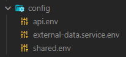
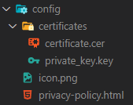
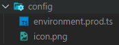

<!-- @ https://github.com/othneildrew/Best-README-Template -->

<!-- PROJECT SHIELDS -->
<!--
*** I'm using markdown "reference style" links for readability.
*** Reference links are enclosed in brackets [ ] instead of parentheses ( ).
*** See the bottom of this document for the declaration of the reference variables
*** for contributors-url, forks-url, etc. This is an optional, concise syntax you may use.
*** https://www.markdownguide.org/basic-syntax/#reference-style-links
-->

[![Contributors][contributors-shield]][contributors-url]
[![Forks][forks-shield]][forks-url]
[![Stargazers][stars-shield]][stars-url]
[![Issues][issues-shield]][issues-url]
[![GPL-3.0 License][license-shield]][license-url]

<!-- PROJECT LOGO -->
<br />
<p align="center">
  <a href="https://github.com/NTNM-Bib/Vidijo">
    
  </a>

  <h3 align="center">Vidijo</h3>

  <p align="center">
    A web application for presenting a curated selection of open-access journals.
    <br />
    <br />
    <a href="https://www.vidijo.org">See In Action</a>
    ·
    <a href="https://github.com/NTNM-Bib/Vidijo/issues">Report Bug</a>
    ·
    <a href="https://github.com/NTNM-Bib/Vidijo/issues">Request Feature</a>
  </p>
</p>

<!-- TABLE OF CONTENTS -->

## Table Of Contents

- [Table Of Contents](#table-of-contents)
- [About The Project](#about-the-project)
  - [Built With](#built-with)
- [Getting Started](#getting-started)
  - [Prerequisites](#prerequisites)
  - [Installation](#installation)
  - [Configuration](#configuration)
- [Usage](#usage)
  - [Administration](#administration)
- [License](#license)
- [Contact](#contact)

<!-- ABOUT THE PROJECT -->

## About The Project

[![Vidijo Screen Shot][product-screenshot]](https://www.vidijo.org/journals)

Vidijo is a virtual journal display for open-access journals. The app was developed within the [visOA](https://visoa.leibniz-inm.de/) project with the goal to make open-access publications more visible.
It can be used to browse a curated selection of journals and to quickly access the articles published in them.
By creating a personal user account, journals can be favored and articles can be stored in a reading list.

### Built With

- [Angular](https://angular.io/)
- [Angular Material](https://material.angular.io/)
- [Express](https://expressjs.com/)
- [Docker](https://www.docker.com/)

<!-- GETTING STARTED -->

## Getting Started

You can try out the version of the NTNM library at [vidijo.org][vidijo-url]. More information on how to use the app can be found under [Usage](#usage). If you want to set up Vidijo with your own selection of open-access journals, you can learn more about configuring and deploying your own installation in the following sections.

### Prerequisites

- [Docker](https://www.docker.com/) and [docker-compose](https://docs.docker.com/compose/) must be installed on your server to run this application. Check out the [documentation](https://docs.docker.com/) on how to install both.
- An email account to send verification and password reset emails from
- A valid TLS/SSL certificate (free certificates are available on [Let's Encrypt](https://letsencrypt.org/))

### Installation

1. Clone the repo

```sh
git clone https://github.com/NTNM-Bib/Vidijo.git
```

2. Configure the application

Check out the section [Configuration](#configuration) on how to configure the application. This may take a while but must be done only once.

3. Run the application

```sh
./run.sh
```

You may have to elevate the permissions of `run.sh` first to execute the script (using `chmod`).
The first startup takes a while because dependencies have to be downloaded and installed. Subsequent starts will be much faster.

4. Stop the application

```sh
./stop.sh
```

As before, you may need to elevate the permissions of `stop.sh` as well.

### Configuration

To configure the app, a few folders and files have to be created and adjusted. The project already contains example files and folders that can be used as templates.

1. `/config` folder

Locate the `config.example` folder at the **project root**. Make a copy of it and rename it to `config` (this folder must be in the same directory as the example folder). Open the folder and rename the 3 contained files:

- `api.example.env` to `api.env`
- `external-data.service.example.env` to `external-data.service.env`
- `shared.example.env` to `shared.env`

The result should look like this:



Afterwards the 3 contained files must be adjusted as follows:

- `/config/api.env`

  - `SESSION_SECRET`: generate a long cryptographically random string (you can run `pwgen -s 96` to get secure values)
  - `MAIL_HOST`: the host of the mail service used for sending verification mails (e.g. mail.example.com)
  - `MAIL_USERNAME`: login username of the Vidijo mail account
  - `MAIL_PASSWORD`: login password of the Vidijo mail account
  - `INSTITUTION_NAME`: the name of your institution (will be displayed on the website besides the upper left logo)
  - `API_URI_HOSTED`: the URI of the API (in our case https://vidijo.org/api; replace vidijo.org with your domain)

- `/config/external-data.service.env`

  - `PUBLIC_COVER_URL`: the URI of the stored covers (in our case https://vidijo.org/static/covers; replace vidijo.org with your domain)

- `/config/shared.env`
  - `VIDIJO_URI`: the URI of your Vidijo installation (in our case https://www.vidijo.org; replace www.vidijo.org with your domain)

2. `/backend/api-gateway/config` folder

Locate the `config.example` folder at `/backend/api-gateway` and make a copy of it, and rename it to `config`. Also rename the contained folder `certificates.example` to `certificates`.

- Replace the file `certificate.example.cer` with your own certificate (you may have to combine the intermediate certificate and your websites certificate into one file using the following command: `cat website.cer intermediate.cer > certificate.cer`). The resulting file must be called `certificate.cer`
- Replace `private_key.example.key` with your own private key file (obtained when creating the certificate) and rename it to `private_key.key`
- Replace the `icon.example.png` file with your own icon and rename it to `icon.png`. Make sure that the icon is square (e.g. use a resolution of 96 x 96 pixels)
- Edit the `privacy-policy.example.html` file and save it as `privacy-policy.html`. This file is served when a user wants wants to read your privacy policy. You can use the provided template and edit the HTML body or create your own HTML file

The final config folder should look like this:



3. `/frontend/app/config` folder

Locate the `config.example` folder at `/frontend/app/config.example` and rename the folder and the contained files like before.

- `environment.prod.ts`: you only have to change the value of `institutionName` to the name of your institution. In our case, we use "NTNM Library". This string will be displayed besides the main logo in the upper left corner on the website
- `icon.png`: you can reuse the icon you set in step 2 (`/backend/api-gateway/config/icon.png`). This icon is displayed as the main icon on the website and is used to generate an icon for Android and iOS

The final folder should look like this:



This concludes the configuration of the application. Please make sure that all files are named correctly; otherwise, the app won't run correctly. Check out step 3 of the [Installation](#installation) section to run your Vidijo installation.

<!-- USAGE EXAMPLES -->

## Usage

TODO: Usage

### Administration

TODO: Admin Usage

<!-- LICENSE -->

## License

Distributed under the GPL-3.0 License. See `LICENSE.md` for more information.

<!-- CONTACT -->

## Contact

Uwe Geith _(Project Manager)_ - uwe.geith@leibniz-inm.de  
Thomas Kraß _(Developer)_ - krass@ntnm-bib.de

Source code available at: [https://github.com/NTNM-Bib/Vidijo](https://github.com/NTNM-Bib/Vidijo)

<!-- MARKDOWN LINKS & IMAGES -->
<!-- https://www.markdownguide.org/basic-syntax/#reference-style-links -->

[contributors-shield]: https://img.shields.io/github/contributors/NTNM-Bib/Vidijo.svg?style=flat
[contributors-url]: https://github.com/NTNM-Bib/Vidijo/graphs/contributors
[forks-shield]: https://img.shields.io/github/forks/NTNM-Bib/Vidijo.svg?style=flat
[forks-url]: https://github.com/NTNM-Bib/Vidijo/network/members
[stars-shield]: https://img.shields.io/github/stars/NTNM-Bib/Vidijo.svg?style=flat
[stars-url]: https://github.com/NTNM-Bib/Vidijo/stargazers
[issues-shield]: https://img.shields.io/github/issues/NTNM-Bib/Vidijo.svg?style=flat
[issues-url]: https://github.com/NTNM-Bib/Vidijo/issues
[license-shield]: https://img.shields.io/github/license/NTNM-Bib/Vidijo.svg?style=flat
[license-url]: https://github.com/NTNM-Bib/Vidijo/blob/master/LICENSE.md
[product-screenshot]: images/screenshot.png
[vidijo-url]: https://www.vidijo.org
