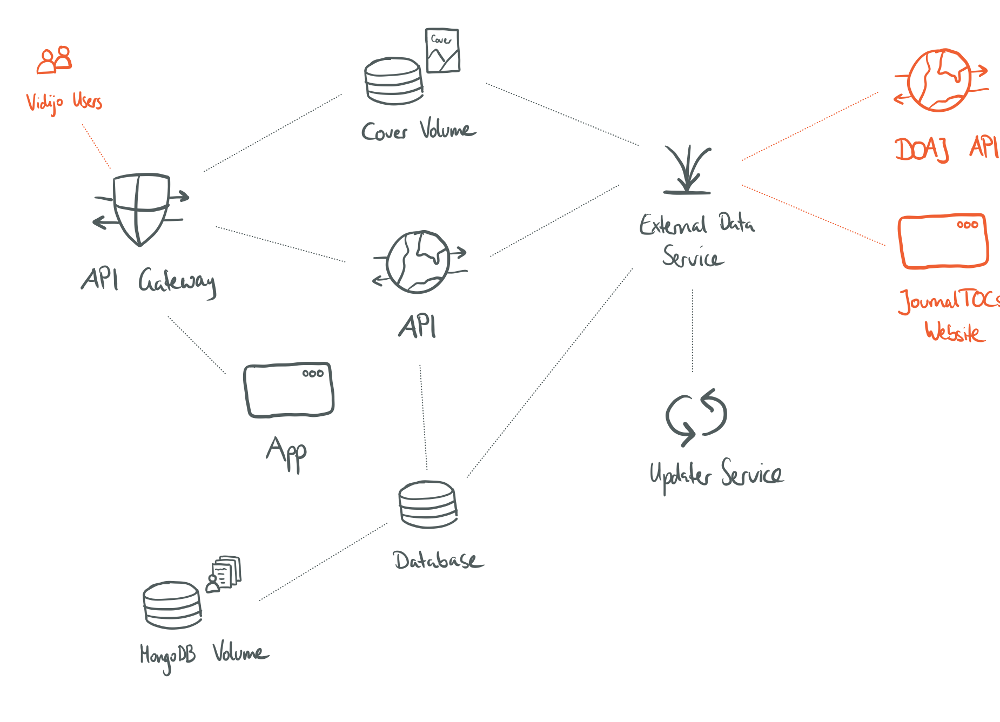

# Vidijo Documentation

This folder contains the documentation for Vidijo. Its purpose is to provide an overview over the project and entrypoints for troubleshooting problems that might arise in the future when third-party dependencies change.

- [Vidijo Documentation](#vidijo-documentation)
  - [General Information](#general-information)
  - [Project Structure](#project-structure)
    - [Project Root](#project-root)
    - [Services](#services)
      - [Source Code](#source-code)
    - [App (Frontend)](#app-frontend)
      - [Example](#example)
  - [Architecture](#architecture)
    - [App (Frontend)](#app-frontend-1)
    - [Services](#services-1)
      - [API Gateway](#api-gateway)
      - [API](#api)
      - [External Data Service](#external-data-service)
      - [Updater Service](#updater-service)
    - [Volumes](#volumes)
      - [MongoDB Volume](#mongodb-volume)
      - [Covers Volume](#covers-volume)
    - [Third-Party Services](#third-party-services)
      - [DOAJ API](#doaj-api)
      - [JournalTOCs Website](#journaltocs-website)
  - [Maintenance](#maintenance)
    - [Updating certificates](#updating-certificates)
    - [Troubleshooting](#troubleshooting)
      - [Downloading Journals](#downloading-journals)
      - [Downloading Articles](#downloading-articles)
      - [Automatic Cover Download](#automatic-cover-download)
      - [Third-Party Software](#third-party-software)

## General Information

Vidijo is developed with software from the [MEAN Stack][mean]. We use [TypeScript][ts] instead of JavaScript for frontend and backend service development.

The frontend uses [Angular][ng] as a framework and [Angular Material][ng-mat] as its User Interface library.

The backend consists of 3 different services using the [Express][express] framework and 1 reverse proxy (using [NGINX][nginx]). We use a single instance of [MongoDB][mongo] to store the majority of the data.

Each component of Vidijo runs inside their own container using [Docker][docker]. The entire architecture is configured to run inside containers for development and deployment.

More information about the architecture of the project and the interplay between components can be found in the chapter [Architecture](#architecture).
If you want to find out more about the structure of the project and the tasks of important files, continue with the [next chapter](#project-structure) instead.

## Project Structure

This section provides an overview over the folder structure and some important files of the project.

### Project Root

The following folders are present in the root project directory.

| Folder                 | Content                                                                |
| ---------------------- | ---------------------------------------------------------------------- |
| `/backend/`            | contains all [backend services](#services-1)                           |
| `/config/`             | contains the main configuration (created by admin on installation)     |
| `/config.dev/`         | contains the config for development (created by admin on installation) |
| `/config.dev.example/` | contains an example development configuration                          |
| `/config.example/`     | contains an example main configuration                                 |
| `/docs/`               | contains the documentation                                             |
| `/frontend/`           | contains the [frontend application](#app-frontend-1)                   |
| `/images/`             | contains images displayed in the main `README.md`                      |
| `/util/`               | contains utility scripts (e.g. for dependency updates)                 |

### Services

Each backend service (except the [API Gateway](#api-gateway)) is build after the following structure. More information about the API Gateway can be found in the section [Updating Certificates](#updating-certificates).

| Folder / File       | Content / Task                                                                      |
| ------------------- | ----------------------------------------------------------------------------------- |
| `node_modules/`     | contains the third-party library files (created on installation in development)     |
| `src/`              | contains the source code of this service                                            |
| `.dockerignore`     | a file to tell Docker which folders should be ignored                               |
| `.prettierrc`       | a file to enforce consistent formatting in the service (using [Prettier][prettier]) |
| `dev.Dockerfile`    | the [Dockerfile][dockerfile] used in development                                    |
| `Dockerfile`        | the [Dockerfile][dockerfile] used in production                                     |
| `gulpfile.ts`       | a file containing automated tasks using [Gulp][gulp]                                |
| `package-lock.json` | automatically generated by npm (see [here][package-lock])                           |
| `package.json`      | file with _npm_ scripts and metadata about the service (see [here][package])        |
| `tsconfig.json`     | file for setting up the [TypeScript][ts] compiler                                   |

#### Source Code

This is an overview over the `src/` folder inside the backend services (using the API as an example). Some services might contain additional files (e.g. `auth.ts` in the API), but this is an overview over the files and folders that are present in most services.

| Folder / File         | Content / Task                                                                          |
| --------------------- | --------------------------------------------------------------------------------------- |
| `routes/`             | contains the API endpoints (e.g. `GET /journals/:id` in `journal.router.ts`)            |
| `routes/controllers/` | contains the handlers that are invoked when calling an endpoint                         |
| `shared/`             | contains folders and files that are shared between services                             |
| `templates/`          | contains templates for verification and password reset mails                            |
| `*.config.ts`         | contains methods to safely read configuration from environment variables (`.env` files) |
| `app.ts`              | defines the Express App (see [here][express-app] for more information)                  |
| `index.ts`            | the main entry point for the service (sets up the database connection, server and more) |

### App (Frontend)

The structure of the frontend follows the conventions used in [Angular][ng] projects. Only components are organized in a slightly different way.

| Component Sub-Folder | Content                                                                                 |
| -------------------- | --------------------------------------------------------------------------------------- |
| `components/`        | contains the presentation components that can be used inside the pages (e.g. a journal) |
| `pages/`             | contains the pages of this module (e.g. the discover page)                              |
| `shared/`            | contains shared files for this module, like services and interfaces                     |
| `*.module.ts`        | the module definition                                                                   |

#### Example

The folder `src/app/journals` is organized in the above mentioned way. The `components/` folder contains a folder `journal-thumbnail/` which contains the logic, styles and markup for representing a journal in the application. This component is used throughout the entire application on different pages like the discover page, home page and more. It is saved under `components/` since we do not use it as an entire page itself, but only embed it inside other pages.

The `pages/` folder inside `src/app/journals` contains the main pages of the application, that can be accessed via different routes. The `discover/` folder - for example - contains the logic, styles and markup to build up the page that is accessible under `https://vidijo.org/discover`. Pages like the discover page use other presentation components from the `components/` folder to populate them with content. The task of the page logic is to fetch data using different services (like `journal.service.ts` in the `shared/` folder) and setting up the presentation components using that data (e.g. the discover page fetches the most read journals and spawns a new `journal-thumbnail` for each journal).

The `shared/` folder inside `src/app/journals` contains interfaces to define custom types and, more importantly, the service to fetch data (`journal.service.ts`). This service connects the app to our API and can change the received data in a way to make it usable in the frontend.

## Architecture

This section provides an overview over the architecture of Vidijo and how the services are connected. You can find more information about each service [below](#services).

The **orange-colored** entities and connections represent everything that is outside of the internal Vidijo network. We've got users on the left that want to access the Vidijo website and we also have our data sources on the right (DOAJ API and JournalTOCs Website). Since the connection to these entities runs over the internet, they are colored in orange.

Everything else is colored in **dark grey** and represents entities that belong to the internal network of Vidijo components. These components are connected via the local [Docker Bridge Network][docker-bridge] which is isolated from the internet. Since this local network is not reachable from outside, we can internally abandon access control for these services. The only exception is the API, which performs user authentication and authorization for incoming requests and delegates tasks to the other internal services.

### App (Frontend)

The code for the frontend application can be found in `/frontend/api`.

This is the frontend for Vidijo - it is written in [TypeScript][ts] using the [Angular][ng] framework.

The frontend gets build inside a temporary container and deployed inside another container using [NGINX][nginx].
It can be accessed by the public via the [API Gateway](#api-gateway) that redirects requests to the app container.

### Services

An overview over the backend services.

#### API Gateway

The code for the API Gateway can be found in `/backend/api-gateway`.

The API Gateway is the only service of Vidijo that is exposed to its users. Thats why it needs valid TLS certificates (updating certificates is described in the chapter [Maintenance](#maintenance)).

Its job is to receive requests and redirect them to the according services.
An example: A user requests `https://vidijo.org/` - the gateway redirects the request to the frontend container and serves the client application.
Another example: The user requests `https://vidijo.org/api/v1/journals` - the gateway redirects the request to the API container and serves the JSON response containing journals.

#### API

The code for the API can be found in `/backend/api`.

The API connects the frontend with the entire backend. It performs user authentication and authorization and can handle tasks on its own like getting queried articles or journals from the database and sending them to the frontend.

Another important task is to receive requests from the client and delegate them to the other backend services. For example: An admin wants to add a new journal to Vidijo: the frontend sends a POST request to the API which delegates the task to the [External Data Service](#external-data-service).

This approach is used to provide a single interface between frontend and backend but also make is possible to separate areas of concern and not slow down the API with resource heavy tasks like fetching new articles from [DOAJ][doaj].

#### External Data Service

The code for this service can be found in `/backend/external-data.service`.

The job of this service is to be the bridge between external services and the Vidijo architecture. Its tasks are the following.

- search journals in [DOAJ][doaj]
- download journals from [DOAJ][doaj] and convert them to our own format
- download articles from [DOAJ][doaj] and convert them to our own format
- try finding a cover for newly added journals using the [JournalTOCs][jt] website
- sanitize incoming data (e.g. by removing HTML tags and duplicate authors)

#### Updater Service

The code for this service can be found in `/backend/updater.service`.

This service runs in the background and updates journals in a set interval (e.g. 1 journal every 10 minutes). It selects the journal that has not been updated for the longest time from our database and sends a command to the [External Data Service](#external-data-service) to fetch the articles of this journal from [DOAJ][doaj].

### Volumes

Volumes are used in Docker to provide persistent data storage. If we did not use volumes, we would lose all of our data when recreating containers. They also provide a way to share data between containers. This is especially useful for the [Covers Volume](#covers-volume).

#### MongoDB Volume

This volume is only mounted into the database container and provides persistent storage for our instance of MongoDB. In MongoDB, we save all journals, articles, users and more; basically everything except covers and the privacy policy.

#### Covers Volume

This volume contains all journal covers. It is used by the [API Gateway](#api-gateway) to make the covers accessible to the application, by the [External Data Service](#external-data-service) as a place to store the automatically downloaded covers and by the [API](#api) as a place to store uploaded covers.

### Third-Party Services

We use [DOAJ][doaj] as our main data source to retrieve journals and articles. Since the [DOAJ] API does not provide journal covers, we use the [JournalTOCs][jt] website for this task instead.

#### DOAJ API

#### JournalTOCs Website

## Maintenance

### Updating certificates

### Troubleshooting

We depend on third-party services to download journals, articles and covers and on multiple third-party packages to implement features.
Since software changes with time, some problems might occur that prevent Vidijo from working correctly.

This section aims to provide entrypoints for fixing problems that are caused by changing third-party software.

#### Downloading Journals

#### Downloading Articles

#### Automatic Cover Download

#### Third-Party Software

[mean]: https://en.wikipedia.org/wiki/MEAN_(solution_stack)
[ts]: https://www.typescriptlang.org/
[ng]: https://angular.io/
[ng-mat]: https://material.angular.io/
[mongo]: https://www.mongodb.com/
[express]: https://expressjs.com/
[express-app]: http://expressjs.com/en/5x/api.html#app
[nginx]: https://www.nginx.com/
[docker]: https://www.docker.com/
[docker-bridge]: https://docs.docker.com/network/bridge/
[dockerfile]: https://docs.docker.com/engine/reference/builder/
[doaj]: https://doaj.org/
[jt]: http://www.journaltocs.ac.uk/
[prettier]: https://prettier.io/
[gulp]: https://gulpjs.com/
[package-lock]: https://docs.npmjs.com/cli/v6/configuring-npm/package-lock-json
[package]: https://docs.npmjs.com/cli/v6/configuring-npm/package-json
